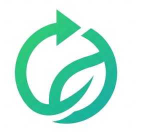

<p align="center">
  
</p>

<h1 align="center">ReVive</h1>
<p align="center"><strong>Don't Replace. Revive.</strong></p>
<p align="center">
  An AI Agent that helps every unwanted product find its best next life — Sell, Repair, Repurpose, Donate, Exchange, or Recycle.
</p>

<p align="center">
  
  
  
  
  
</p>

<p align="center">
  <strong>Prototype link:</strong> <a href="https://revive-two-xi.vercel.app">https://revive-two-xi.vercel.app</a>
</p>

---

## 🚨 The Problem

**Millions of usable products are thrown away or gathering dust** — not because they're worthless, but because people don't know what to do with them next.

- Should I sell my old phone? Where? For how much?
- Can this broken laptop be repaired? Is it worth it?
- My old thermos is sitting in the cabinet — can I repurpose it somehow?
- Where do I even donate furniture in my city?

There's no single platform that helps users **evaluate, compare, and decide** the best next step for any product they no longer need.

---

## 💡 The Solution

**ReVive** is an AI-powered agent that scans any product you no longer need and generates **multiple creative, actionable paths** for giving it a second life.

Unlike a simple "sell or recycle" tool, ReVive:

- 🧠 **Thinks beyond the obvious** — suggests creative repurposing (use a thermos as a planter), specific platforms to sell on (OLX, Cashify, Facebook Marketplace), and local services
- 📍 **Knows your city** — gives location-aware recommendations (e.g., "In Delhi, try Nehru Place for laptop repairs")
- 🎯 **Picks the best path** — AI recommends the optimal action with a confidence-backed reasoning
- 🚫 **Detects BS** — flags non-product uploads (dogs, food, selfies) with friendly, humorous messages
- 🌍 **Works for anything** — not limited to electronics; scan furniture, kitchenware, books, sports gear, clothing, and more

---

## 🔄 How It Works

```
┌─────────┐     ┌──────────┐     ┌──────────────┐     ┌───────────────────┐
│  📸     │     │  🤖      │     │  📋          │     │  🎯               │
│  SCAN   │ ──▶ │  DETECT  │ ──▶ │  QUESTIONS   │ ──▶ │  MULTIPLE PATHS   │
│  Upload │     │  AI ID + │     │  Condition,  │     │  Sell, Repair,    │
│  or     │     │  BS      │     │  Age, City,  │     │  Repurpose,       │
│  Camera │     │  Filter  │     │  Functional  │     │  Donate, Recycle  │
└─────────┘     └──────────┘     └──────────────┘     └───────────────────┘
```

1. **Scan** — Take a photo or upload an image of any product
2. **Detect** — AI identifies the product, its category, and filters out non-product uploads
3. **Answer** — 3-4 quick questions about condition, age, and functionality
4. **Discover** — Get 5-7 creative, actionable paths with:
   - Specific platforms & places (where to sell, who to donate to)
   - Price estimates in ₹
   - Step-by-step instructions
   - Difficulty & time estimates
   - Environmental impact
   - AI's top recommendation with reasoning

---

## 🖥️ Tech Stack (Prototype)

| Layer | Technology | Purpose |
|-------|-----------|---------|
| **Frontend** | React 19 + Vite 8 | Fast, modern SPA framework |
| **Styling** | Vanilla CSS + Custom Properties | Green-themed design system, no framework dependency |
| **AI Engine** | Google Gemini 2.5 Flash | Multimodal image analysis, product identification, content moderation, and recommendation generation |
| **Camera** | MediaDevices API (`getUserMedia`) | Native browser camera access (rear-facing) |
| **Routing** | React Router v7 | Client-side navigation |
| **Deployment** | Vercel | HTTPS, instant deploy, shareable demo URL |
| **App Type** | Progressive Web App (PWA) | Installable on mobile, works offline |

---

## 🚀 Quick Start

### Prerequisites
- Node.js 18+
- A Google Gemini API key ([Get one free at aistudio.google.com](https://aistudio.google.com))

### Setup

```bash
# Clone the repo
git clone https://github.com/your-username/ReVive.git
cd ReVive

# Install dependencies
npm install

# Create environment file
echo "VITE_GEMINI_API_KEY=your_gemini_api_key_here" > .env.local

# Start the development server
npm run dev
```

Open **http://localhost:5173** on your browser (works best on mobile or in mobile-responsive mode).

---

## 📁 Project Structure

```
ReVive/
├── src/
│   ├── App.jsx                 # Router — 3 routes (Landing, Scan, Results)
│   ├── App.css                 # Design system — green theme, tokens, components
│   ├── main.jsx                # Entry point
│   ├── lib/
│   │   └── gemini.js           # Gemini API — moderation + multi-path analysis
│   └── pages/
│       ├── Landing.jsx         # Welcome screen — hero, CTA, how-it-works
│       ├── Scan.jsx            # Camera/upload, BS detection, smart questions
│       └── Results.jsx         # Product card, AI paths, recommendation
├── public/
│   ├── manifest.json           # PWA configuration
│   └── revive-logo.svg         # App icon
├── index.html                  # SEO meta tags + PWA setup
├── vite.config.js              # Vite + React plugin
├── vercel.json                 # SPA routing for Vercel deploy
└── .env.local                  # API key (gitignored)
```

---

## 🛡️ Content Moderation (BS Detection)

ReVive doesn't just accept anything — it uses AI to validate that uploaded images are actual products. Non-product uploads get friendly, humorous rejection messages:

| Upload | Response |
|--------|----------|
| 🐕 Dog/Pet | *"That's adorable, but ReVive is for products, not pets!"* |
| 🍕 Food | *"Looks delicious, but we can't recycle pizza!"* |
| 🤳 Selfie | *"Great photo! But we're looking for items to revive, not people."* |
| 🌳 Nature | *"Beautiful view! But scan a product — a phone, a chair, a flask."* |
| 🚫 Inappropriate | *"This content isn't appropriate. ReVive helps products find new life."* |

---

## 🌍 Supported Categories

ReVive is **not limited to electronics**. The AI is category-agnostic and can analyze:

| Category | Examples |
|----------|---------|
| 📱 Electronics | Phones, Laptops, Tablets, Headphones, Speakers |
| 🪑 Furniture | Chairs, Desks, Shelves, Tables, Beds |
| 🏠 Appliances | Fans, Mixers, Iron, Microwave, AC |
| 🍶 Kitchenware | Thermos, Cookware, Bottles, Utensils |
| 👟 Sports & Fitness | Cycles, Dumbbells, Yoga mats, Rackets |
| 📚 Books & Media | Books, CDs, DVDs, Board games |
| 🎸 Musical Instruments | Guitars, Keyboards, Drums |
| 🔧 Tools | Power tools, Hand tools, Garden equipment |
| 👕 Clothing & Accessories | Jackets, Shoes, Bags, Watches |
| 🧸 Toys | Action figures, Board games, Stuffed animals |

---

## 🔮 Vision — The Final Product

The current prototype is an MVP built for the hackathon. Here's where ReVive is headed:

### Phase 1: Enhanced AI Agent
- **x402 Protocol on Algorand** — AI agent autonomously pays for external services (live market pricing APIs, repair cost databases) using x402 micropayments on the Algorand blockchain, making decisions more accurate and real-time
- **Multi-image scan** — Upload multiple angles for more accurate analysis
- **Barcode/model detection** — Automatically identify exact make and model

### Phase 2: Marketplace & Services Network
- **In-app marketplace** — Connect sellers directly with verified buyers
- **Repair partner network** — Book verified repair services directly from the app
- **NGO & donation directory** — One-tap donations to verified organizations
- **Exchange matching** — Match users who want to swap products

### Phase 3: Gamification & Community
- **Green Points** — Earn points for sustainable actions (donate = 100pts, recycle = 50pts)
- **Badges & Achievements** — "Eco Warrior", "Donation Hero", "10 Items Revived"
- **Campus/City Leaderboards** — Compete with peers for environmental impact
- **Social Sharing** — Generate shareable impact cards for social media
- **Impact Dashboard** — Track personal stats: items saved, CO₂ reduced, ₹ saved

### Phase 4: Scale & Expand
- **Beyond products** — Vehicles, real estate, commercial equipment
- **B2B partnerships** — Corporate e-waste management, office furniture recycling
- **Government integration** — Municipal recycling programs, certified e-waste centers
- **Carbon credit tracking** — Quantify and potentially monetize environmental impact
- **Multi-language support** — Hindi, Tamil, Telugu, and more regional languages

### Architecture Vision

```
┌─────────────────────────────────────────────────────┐
│                    ReVive Platform                    │
├──────────┬──────────┬──────────┬───────────┬────────┤
│  Mobile  │  Web     │  AI      │  x402     │ Market │
│  App     │  App     │  Agent   │  Payment  │ place  │
│  (PWA)   │  (React) │  (Gemini)│  (Algorand)│       │
├──────────┴──────────┴──────────┴───────────┴────────┤
│           Repair Partners · NGOs · Buyers            │
│           Recyclers · Exchange Network               │
├─────────────────────────────────────────────────────┤
│     Gamification · Leaderboards · Impact Tracking    │
└─────────────────────────────────────────────────────┘
```

---

## 🌱 Impact We Aim to Create

| Metric | Goal |
|--------|------|
| 💰 **₹ Saved** | Help users recover value from products they'd otherwise discard |
| 🗑️ **Waste Avoided** | Reduce landfill waste by redirecting usable products |
| 🌿 **CO₂ Reduced** | Lower carbon footprint through reuse, repair, and responsible recycling |
| ❤️ **Lives Impacted** | Connect working products with people who need them via donations |
| 🔄 **Circular Economy** | Promote a culture of reuse over replacement |

---

## 👥 Team

Built for the hackathon with ❤️ and lots of chai.

---

## 📄 License

MIT License — see [LICENSE](LICENSE) for details.

---

<p align="center">
  <strong>Scan today. Revive tomorrow. Sustain forever.</strong>
</p>
